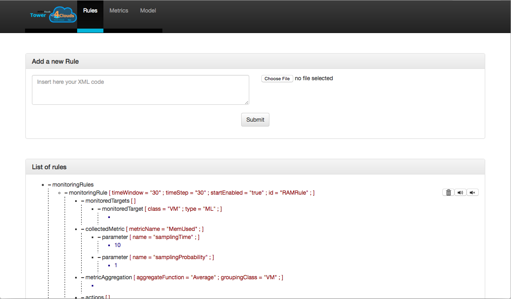
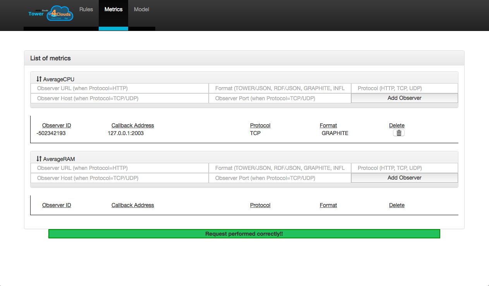
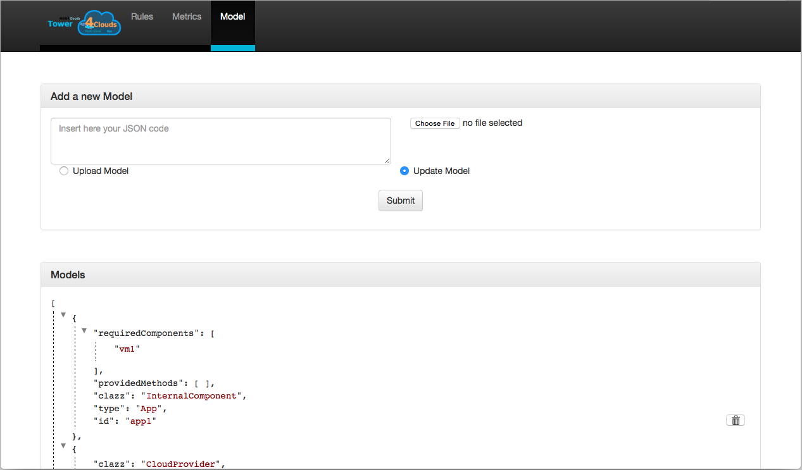

#Webapp

The Webapp is accessible at the [configured][Configuration] manager port under the url path `/webapp`.

## The Rules Tab

From this view the user can explore all installed [Rules], as well as disable, enable or delete them. The user can also install new ones by means of the "Add a new Rule" box, where rules can be either copy pasted in the text area or uploaded from an xml file.

## The Metrics Tab

Here the user can explore all [Output Metrics] as well as view, delete and attach new [Observers] to them. If your observer listens on a Socket TCP or UDP port then you should specify only the following fields:
- Observer Host, with the IP address of the observer
- Observer Port, with the Port to which the observer listens to
- Format, with one of the [Serialization Formats] provided by the [Data Analyzer]
- Protocol, one of `TCP` or `UDP`

If your observer uses an `HTTP` protocol, only the following fields should be specified:
- Observer Url, with the complete url of the observer endpoint (e.g.: http://my.observer:9999/metrics)
- Format, with one of the [Serialization Formats] provided by the [Data Analyzer],
- Protocol, with `HTTP`

## The Model Tab

In this Tab the user can explore the current [Model], as well as add resources to or remove resources from the model. Consider that [Data Collectors] are in charge of keeping their respective sub graph alive, therefore if you try to delete a resource which is kept alive by a running data collector, it will be restored. On the other side, if you add new resources from this tab, those resources will have an infinite keep alive period, i.e., they won't ever expire unless manually deleted through the webapp or through the [REST API]. 

[Configuration]: configuration.html
[Rules]: ../rules/
[Output Metrics]: ../rules/actions.html#output-metric
[Observers]: ../observers
[Serialization Formats]: ../data-analyzer/serialization-formats.html
[Data Analyzer]: ../data-analyzer
[Model]: ../model
[Data Collectors]: ../data-collectors
[REST API]: ../manager/rest-api.html