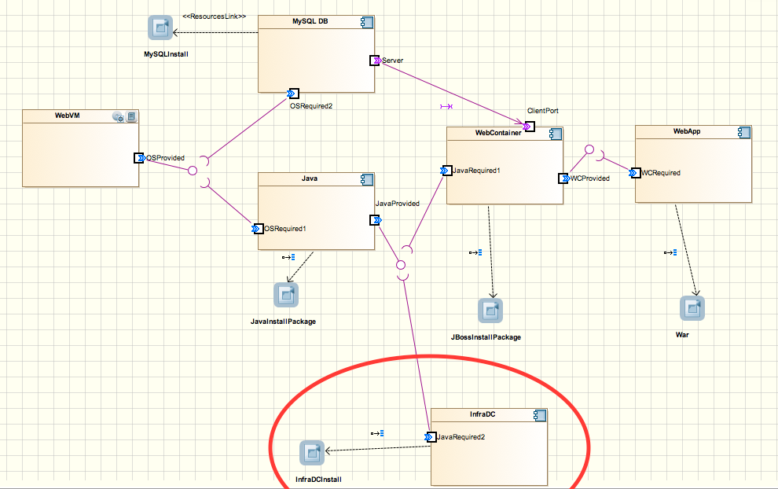
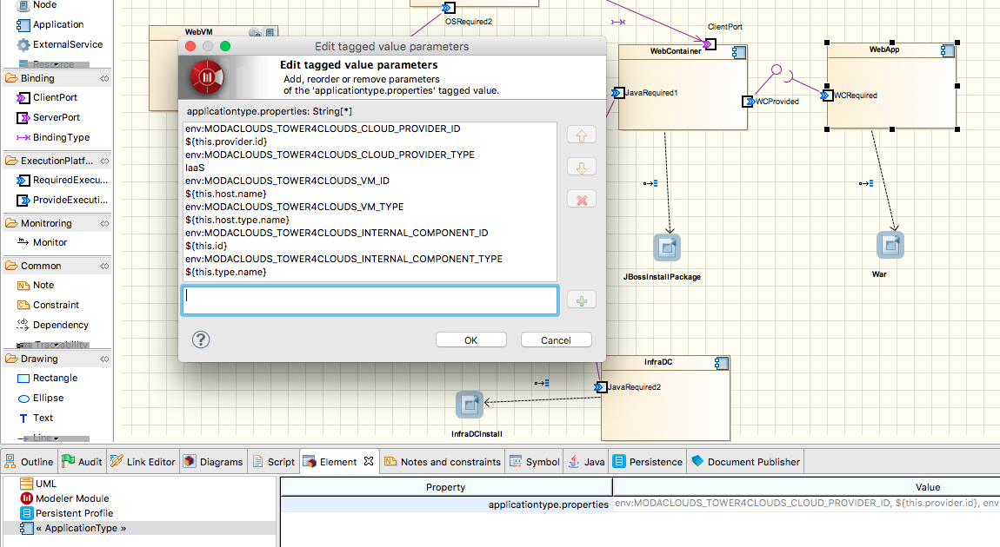

# Tutorial
In this tutorial we see how to use Tower 4Clouds exploiting Creator 4Clouds and CloudML 4Clouds.

## Use case application
For our tutorial we are going to use Ticket Monster, a Java EE application developed
by JBoss for demo purposes. You can find the source code, already instrumented with
the [Java Application Data Collector] on the `modaclouds` branch of [https://github.com/deib-polimi/ticket-monster](https://github.com/deib-polimi/ticket-monster).


## Instrumenting Ticket Monster with the Java App DC

The Java App DC was first added as dependency.

```xml
...
<dependencies>
	...
	<dependency>
		<groupId>it.polimi.tower4clouds</groupId>
		<artifactId>java-app-dc</artifactId>
		<version>0.4-SNAPSHOT</version>
		<exclusions>
			<exclusion>
				<groupId>it.polimi.tower4clouds</groupId>
				<artifactId>rules</artifactId>
			</exclusion>
			<exclusion>
				<artifactId>jsr311-api</artifactId>
				<groupId>javax.ws.rs</groupId>
			</exclusion>
			<exclusion>
				<artifactId>slf4j-api</artifactId>
				<groupId>org.slf4j</groupId>
			</exclusion>
		</exclusions>
	</dependency>
	...
</dependencies>
...
<repositories>
	...
	<repository>
			<id>deib-polimi-releases</id>
			<url>https://github.com/deib-polimi/deib-polimi-mvn-repo/raw/master/releases</url>
		</repository>
		<repository>
			<id>deib-polimi-snapshots</id>
			<url>https://github.com/deib-polimi/deib-polimi-mvn-repo/raw/master/snapshots</url>
		</repository>
		...
</repositories>
...
<build>
	...
	<plugins>
		...
		<plugin>
				<groupId>org.codehaus.mojo</groupId>
				<artifactId>aspectj-maven-plugin</artifactId>
				<version>1.5</version>
				<executions>
					<execution>
						<goals>
							<goal>compile</goal>
							<goal>test-compile</goal>
						</goals>
					</execution>
				</executions>
				<configuration>
					<complianceLevel>1.7</complianceLevel>
					<source>1.7</source>
					<target>1.7</target>
					<aspectLibraries>
						<aspectLibrary>
							<groupId>it.polimi.tower4clouds</groupId>
							<artifactId>java-app-dc</artifactId>
						</aspectLibrary>
					</aspectLibraries>
				</configuration>
			</plugin>
			...
		</plugins>
		...
	</build>
	...
```

A servlet used for inizialization is then implemented, which retrieves variables from the environement containing information about the context where the app is going to be deployed and starts the data collector.

```java
package org.jboss.jdf.example.ticketmonster.monitoring;

import it.polimi.tower4clouds.java_app_dc.Property;
import it.polimi.tower4clouds.java_app_dc.Registry;

import java.util.HashMap;
import java.util.Map;

import javax.servlet.ServletContextEvent;
import javax.servlet.ServletContextListener;
import javax.servlet.annotation.WebListener;

import org.jboss.jdf.example.ticketmonster.rest.BaseEntityService;
import org.slf4j.Logger;
import org.slf4j.LoggerFactory;

@WebListener
public class ConfigurationInitializer implements ServletContextListener {

	@Override
	public void contextDestroyed(ServletContextEvent sce) {
		Registry.stopMonitoring();
	}

	@Override
	public void contextInitialized(ServletContextEvent sce) {
		Map<Property, String> applicationProperties = new HashMap<Property, String>();
		applicationProperties.put(Property.ID, loadVariable("MODACLOUDS_TOWER4CLOUDS_INTERNAL_COMPONENT_ID", "_ic1"));
		applicationProperties.put(Property.TYPE, loadVariable("MODACLOUDS_TOWER4CLOUDS_INTERNAL_COMPONENT_TYPE","WebApp"));
		applicationProperties.put(Property.VM_ID, loadVariable("MODACLOUDS_TOWER4CLOUDS_VM_ID", "_vm1"));
		applicationProperties.put(Property.VM_TYPE, loadVariable("MODACLOUDS_TOWER4CLOUDS_VM_TYPE","WebVM"));
		applicationProperties.put(Property.CLOUD_PROVIDER_ID, loadVariable("MODACLOUDS_TOWER4CLOUDS_CLOUD_PROVIDER_ID", "_cp1"));
		applicationProperties.put(Property.CLOUD_PROVIDER_TYPE, "IaaS");
		String mpIP = loadVariable("MODACLOUDS_TOWER4CLOUDS_MANAGER_IP", "localhost");
		String mpPort = loadVariable("MODACLOUDS_TOWER4CLOUDS_MANAGER_PORT", "8170");
		Registry.initialize(mpIP, Integer.parseInt(mpPort), applicationProperties,
				BaseEntityService.class.getPackage().getName(), false, true);
		Registry.startMonitoring();
	}

	public static String loadVariable(String variableName, String defaultValue) {
		if (System.getenv().containsKey(variableName)) {
			return System.getenv(variableName);
		}
		return defaultValue;
	}

}
```

Note that, by setting the last parameter of `Registry.initialize(...)` to true, we instructed the data collector to monitor all methods annotated with JAXRS annotations (i.e., @GET, @POST, @DELETE, @PUT).

## Modeling the application with Creator 4Clouds
We then modeled the deployment of Ticket Monster on Creator 4Clouds. A tutorial on how to use Creator 4Clouds can be found at this [link](http://forge.modelio.org/projects/creator-4clouds/wiki/Creator4Clouds-Tutorial-C4C).

## Modeling Data Collectors in Creator 4Clouds
Data collectors must be deployed together with the application therefore they must be modeled in Creator 4Clouds in order to be deployed. The [Java Application Data Collector] is a library and therefore there's no need of modeling it, it will be deployed together with the web app.

We wanted to add the standalone data collector developed by Imperial (https://github.com/imperial-modaclouds/modaclouds-data-collectors) for monitoring CPU utilization of our WebVM. So we modeled it at the Type Level of our CPIM Model as shown in the following figure.



Data collectors also require information about the resources they monitor and their context. We therefore added such information to the WebApp component as application properties as shown in the following figure.



Such environement variables will be exported by CloudML 4Clouds during deployment.

## Modeling monitoring rules
We want to monitor CPU utilization of the WebVM, the response time and the throughput of all API exposed by the WebApp. We therefore need to add 3 [Monitoring Rules].
Inside Creator 4Clouds, at the CPIM level, right click on Monitoring Rules > Creator4Clouds > Elements > "create monitoring rule". Then, we added monitoring rules field as shown in the following figure.


In order to add tagets (or `monitors` dependencies) to monitoring rules just drag and drop rules to the diagram where the target resource is visible and use the `monitor link` to link rules to resources. The following figures show the result.


## Deployment
Once the CPSM model is generated and the required cloud providers information is added the application and the rules can be deployed.

The application instrumented with data collectors is deployed by means of CloudML 4Clouds. In Creator 4Clouds: right click on the CPSM deployment model > Creator4Clouds > CloudML 4Clouds > "publish application...". Rules must be registered in Tower 4Clouds and can be done from Creator 4Clouds as well by: right click on the CPSM deployment model > Creator4Clouds > Tower 4Clouds > "Publish monitoring rules...". Tower 4Clouds Manager IP address and Port must be provided.

## Attaching the Metrics Explorer (Graphite) to observable metrics
From the [manager webapp](../manager/webapp.md) the installed rules can be visualized. From the metrics tab you can see all observable metrics, and from the model tab you can see the current deployed model (which is updated by data collectors once started).

From the metrics tab you can add the Metrics Explorer as observer to all the 3 available metrics to make it graph the metrics:
* first, you should add graphite host and port (N.B., it must be reachable by the [Data Analyzer])
* then, add `GRAPHITE` as format and `TCP` as protocol
* finally, click "add observer".

We used Grafana as alternative dashboard to the one provided by Graphite and here is the result.


[Java Application Data Collector]: ../data-collectors/java-app-dc.html
[Monitoring Rules]: ../rules/
[Data Analyzer]: ../data-analyzer/
